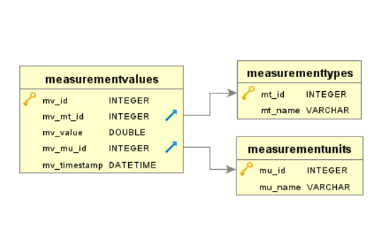

# Weatherstation

This project will address a [Tinkerforge weather station][TFURL]. There are
  - The `device` for reading the data of the weather station.
  - The `remotedevice` for dealing with the data in form of saving them, historize them and compress them somehow.
  - The UI for displaying the data processed by the `remotedevice`.

## General information

[![License: LGPL v3][lgpl_license_badge]][lgpl_license]
[![Language: C#][csharp_lang_badge]][csharp_lang]

**Weatherstation** is distributed under the terms of the **GNU LESSER GENERAL PUBLIC LICENSE**, version 3.0. The text of the license is included in the file [`LICENSE.TXT`](https://github.com/ThirtySomething/Weatherstation/blob/master/LICENSE.TXT "LGPL-3.0") in the project root.

## Motivation

As training for my developer skills, I'm using my [Tinkerforge weather station][TFURL] for excercising.

## Prerequisites

You need to have some software installed to compile this project. There are

- The [Tinkerforge Brick Daemon][TFBrickDaemon] to run the software.
- The [Tinkerforge Brick Viewer][TFBrickViewer] to update the firmwares.
- The [MS .net Core 3.1 SDK][DotNet31SDK] for compiling/extend the software.

## Scenarios

The software consists of several parts. To get a feeling about the parts, see the following scenarios:

- There is only a Raspberry Pi available
  - You have to connect the weatherstation to the Raspberry Pi.
  - You have to run the `Device` on the Raspberry Pi.
  - You have to select some of the [Plugins](./Plugins/Readme.md) to read and store the data.
- There is a Raspberry Pi and a server (either Windows x64 or Linux x64) available
  - You have to connect the weatherstation to the Raspberry Pi.
  - You have to run the `Device` on the Raspberry Pi.
  - You have to select some of the [Plugins](./Plugins/Readme.md) to read and store the data - at least the `MQTT`-plugin is required.
  - You have to run the `RemoteDevice` on the server.
  - You have to select some of the [Data Sink Plugins](./Plugins/DataSink/Readme.md) to store the data.
- There is only a server (either Windows x64 or Linux x64) available
  - You have to connect the weatherstation to the server.
  - You have to run the `Device` on the server.
  - You have to select some of the [Plugins](./Plugins/Readme.md) to read and store the data.

Basically you want to use all [Data Source Plugins](./Plugins/DataSource/Readme.md) and usually not all of the [Data Sink Plugins](./Plugins/DataSink/Readme.md).

## Device

See the [device documentation](./Device/Readme.md) for more details.

## Remotedevice

See the [remotedevice documentation](./RemoteDevice/Readme.md) for more details.

## Plugins

See the [plugin documentation](./Plugins/Readme.md) for more details.

## Build instructions

To build and run the software, see [here](./Build.md) for more details.

## Schema overview

## ERM overview

## ToDos

- Check installation guide for .net 3.1!
- Remember to remove [M2MqttDotnetCore][NGMQTT] NuGet package at `device` before publish
- Setup UI: The combination of a [time series database][TSDB] and an UI like [Grafana][Grafana] looks very promising. Thanks to [Joachim Hummel][JoHu] for inspiration.

[csharp_lang]: https://en.wikipedia.org/wiki/C_Sharp_(programming_language)
[csharp_lang_badge]: https://img.shields.io/badge/language-CSharp-blue.svg
[lgpl_license]: http://www.gnu.org/licenses/lgpl-3.0
[lgpl_license_badge]: https://img.shields.io/badge/License-LGPL%20v3-blue.svg

[DotNet31SDK]: https://dotnet.microsoft.com/download/dotnet-core/scripts
[EFCore]: https://github.com/aspnet/EntityFrameworkCore
[Grafana]: https://grafana.com/
[JoHu]: https://blog.unixweb.de/
[NGMQTT]: https://www.nuget.org/packages/M2MqttDotnetCore/
[TFBrickDaemon]: https://www.tinkerforge.com/en/doc/Downloads.html
[TFBrickViewer]: https://www.tinkerforge.com/en/doc/Downloads.html
[TFURL]: https://www.tinkerforge.com/en/shop/kits/starter-kit-weather-station.html
[TSDB]: https://en.wikipedia.org/wiki/Time_series_database
