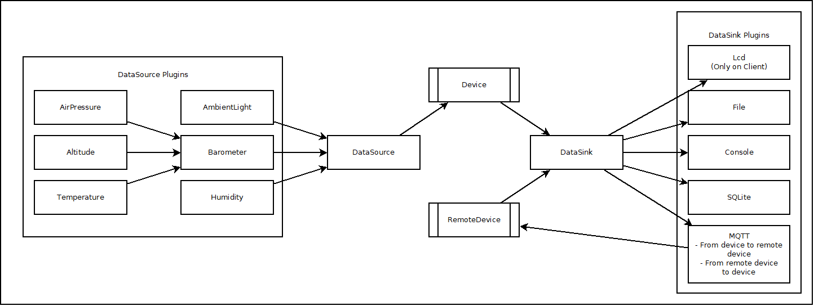

# Weatherstation

This project will address a [Tinkerforge weather station][TFURL]. There are
  - The client for reading the data of the weather station.
  - The server for dealing with the data in form of saving them, historize them and compress them somehow.
  - The UI for displaying the data processed by the server.

## General information

**Weatherstation** is distributed under the terms of the **GNU LESSER GENERAL PUBLIC LICENSE**, version 3.0. The text of the license is included in the file [<code>LICENSE.TXT</code>](https://github.com/ThirtySomething/Weatherstation/blob/master/LICENSE.TXT "LGPL-3.0") in the project root.

## Motivation

As training for my developer skills, I'm using my [Tinkerforge weather station][TFURL] for excercising.

## Client

See the [client documentation](./Client/Readme.md) for more details.

## Server

See the [server documentation](./Server/Readme.md) for more details.

## Plugins

See the [plugin documentation](./Plugins/Readme.md) for more details.

## Build instructions

To build and run the software, see [here](./Build.md) for more details.

## Schema overview

## ToDos

- Remember to remove [M2MqttDotnetCore][NGMQTT] NuGet package at client before publish
- Improve MQTT plugin to handle not acknowledged data.
- Implement server part, consists of
  - Writing data to database (MySQL, MariaDB, ...)
  - Implement a [swinging door algorithm][SDoor] for historizing/compressing the data.
  - Create a HTML frontend with various information
    - Data of current values
    - Historized data
    - Graphics

## Notes for myself
- http://www.et.tu-dresden.de/ifa/uploads/media/PIV006-Archiv.pdf
- https://pisquare.osisoft.com/thread/7566
- https://osipi.wordpress.com/tag/swinging-door-algorithm/
- https://www.hackerboard.de/code-kitchen/50448-c-gesucht-implementierung-des-swinging-door-algorithmus.html
- Is the swinging door a good algorithm to be used for weather data?
- What about [rrdtool](https://de.wikipedia.org/wiki/RRDtool)?
- What about [prometheus](https://prometheus.io/)?
- What about [opentsdb](http://opentsdb.net/)?

[SDoor]:https://support.industry.siemens.com/cs/document/109739594/komprimierung-von-prozesswertarchiven-mit-dem-swinging-door-algorithmus-in-pcs-7?dti=0&lc=de-WW
[TFURL]:https://www.tinkerforge.com/en/doc/Kits/WeatherStation/WeatherStation.html
[NGMQTT]:https://www.nuget.org/packages/M2MqttDotnetCore/